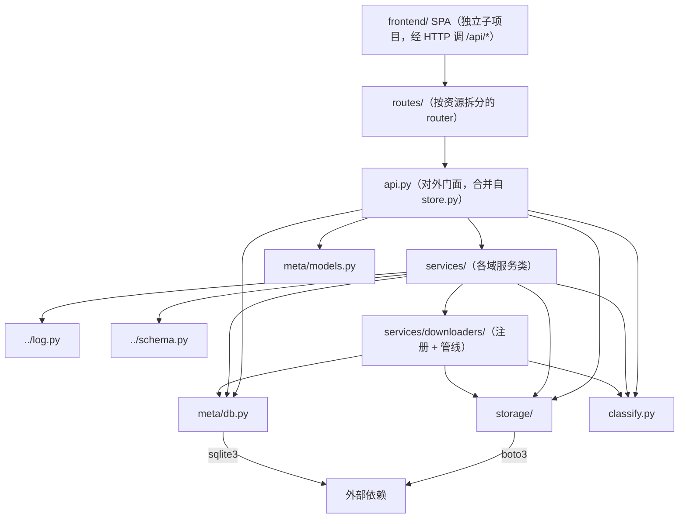

# assets 数据资产层

统一资产管理：数据源（source）CRUD、HF 下载管线（download → process → persist，Ray 并行）、内容寻址存储（本地 / RustFS）、标签、版本、快照、管理 API。元数据权威存 SQLite，blob 存可插拔 StorageBackend。前端 UI 在独立 `frontend/` SPA（只调本层 `/api/*`）。

**对外访问约定**：其他模块只通过 `api.py`（`open_store` + `AssetStore`）访问本层，不直接触碰 `Database` / `StorageBackend` 内部。

## 文件结构

```
src/asset_management/assets/
├── __init__.py          # 包声明；再导出 classify 的 IMAGE_SUFFIXES/classify_image/balance_assets
├── api.py               # 统一对外 API：AssetStore 门面 + open_store 工厂 + SyncReport（合并自原 store.py）
├── classify.py          # 资产分类：classify_image（文件名启发式）+ balance_assets（按类型均衡）
├── meta/                # 元数据管理：SQLite 存取 + dataclass 模型
│   ├── __init__.py      # 再导出 Database / 模型
│   ├── db.py            # Database 类（11 张表 + 分页 + 事务 + 在线备份）
│   └── models.py        # Source/Asset/AssetVersion/Tag/Download/Snapshot 模型
├── storage/             # 存储后端：可插拔 StorageBackend
│   ├── __init__.py      # 再导出 backend 符号
│   ├── base.py          # StorageBackend 抽象 + 内容寻址键
│   ├── local.py         # LocalStorageBackend（本地目录）
│   └── s3.py            # S3StorageBackend（RustFS / MinIO / 云 S3）
├── routes/              # FastAPI 管理界面：每个 API 资源一个 router 文件
│   ├── __init__.py      # create_app（组装各资源 router）+ default_app
│   ├── info.py          # 应用级端点：首页指针 / /api/info / 数据库备份
│   ├── sources.py       # sources 资源：CRUD + 后台 sync 触发
│   ├── sync.py          # sync-run 资源：状态 / pause / resume / 事件流
│   ├── assets.py        # assets 资源：分页列表 / 详情 / 预览 / tag / rollback
│   ├── downloads.py     # downloads 资源：下载记录
│   └── snapshots.py     # snapshots 资源：创建 / 列表
└── services/            # 业务服务层：store.py 按域拆分（一级公民）+ 下载管线（二级公民）
    ├── __init__.py      # 再导出各域服务类；import 副作用注册 processors
    ├── sources.py       # SourcesService：数据源 CRUD + 级联删除
    ├── sync.py          # SyncService：sync 状态机 + 本地导入 + SyncReport
    ├── assets.py        # AssetsService：列表/游标分页/详情/计数/下载记录
    ├── tags.py          # TagsService：标签增删查
    ├── versions.py      # VersionsService：版本提升/历史/回滚
    ├── snapshots.py     # SnapshotsService：快照创建/列表
    ├── materialize.py   # MaterializeService：物化 + pool 清单导出
    ├── maintenance.py   # MaintenanceService：数据库备份
    └── downloaders/     # 下载管线子包（download → process → persist + Ray 编排）
        └── README.md    # 见该目录文档
```

## 各文件职责

| 文件 | 职责 | 关键内容 |
| --- | --- | --- |
| `__init__.py` | 包入口 | 再导出 `classify` 的 `IMAGE_SUFFIXES/classify_image/balance_assets`（CLI 池命令使用） |
| `api.py` | 对外门面 | `open_store` 工厂 + `AssetStore` 组合门面 + `SyncReport`；再导出 `Asset`/`Source`；声明稳定 API 边界 |
| `meta/db.py` | 元数据层 | 11 张表：sources/assets/asset_versions/tags/asset_tags/downloads/snapshots/snapshot_assets/sync_runs/sync_events；WAL + 每线程连接 + `BEGIN IMMEDIATE` 写事务；keyset 分页；在线备份 |
| `meta/models.py` | 数据模型 | 与 SQLite 表一一对应的 dataclass；`ASSET_STATUS` 常量 |
| `storage/base.py` | 存储抽象 | 内容寻址键 `blobs/<sha256[:2]>/<sha256><ext>`；`StorageBackend` 接口（put/get/exists/stream） |
| `storage/local.py` | 本地后端 | 内容寻址目录实现，`put_file` 幂等去重 |
| `storage/s3.py` | S3 后端 | boto3 S3 兼容实现（自动建桶、path-style 寻址、重试） |
| `classify.py` | 资产分类 | `classify_image`：文件名启发式分类（doc_/chart_ 前缀）或显式 labels 映射；`balance_assets`：按类型均衡（CLI 池导出用） |
| `services/sync.py` | 同步服务 | `sync_source` 同步状态机（resolve→Ray 任务→report）；`import_dir` 本地导入；pause/resume；`SyncReport` |
| `services/*.py` | 域服务 | 其余域（sources/assets/tags/versions/snapshots/materialize/maintenance）各司其职，方法来自原 store.py 按域拆分 |
| `routes/*.py` | Web 管理 | 按资源拆分：sources CRUD、assets 分页列表、tag、rollback、快照、图片预览、后台 sync（202 + 轮询 + pause/resume）、数据库备份 |

## 文件间依赖关系



要点：

- **依赖方向单向向下**：routes → api → services →（meta / storage / downloaders / classify），models 只被上层使用，从不依赖上层。
- **api.py 是纯组装层**：`AssetStore` 聚合 `services/` 各域服务类（mixin），只持有共享状态（`_db` / `backend`）并提供生命周期；对外方法签名不变。业务逻辑全在 `services/`。
- **services/sync.py 是枢纽**：`sync_source` 组装 `SyncConfig` 交给 `services/downloaders/ray_data_sync`（Phase A raw 入库 + Phase B 资产处理两条 Ray Data 管线）；本地导入则直接调用 `PersistStage`。
- **meta/db.py 的 `transaction()`（BEGIN IMMEDIATE）是跨进程去重原语**：Ray worker / Web 线程并发写同一 sha256 时串行化，见 persist 阶段。
- **routes 通过 api 取 store**（`default_app` → `open_store`），保证不绕过门面。
- **downloaders 通过 `__init__.py` 的 import 副作用注册 processor**，services 包引入触发注册。

## 数据流向

```
source(s) → sync_source ──► ray_data_sync（Ray Data 两阶段管线）
                              │  Phase A：download → raw/ 层入库（raw_files 登记）
                              │  Phase B：process（file/parquet）→ persist（blobs/ + assets）
                              ▼
本地 import_dir ──────────────────────────────────────────────────► persist ◄── db + storage
                                                                     │
                                                     Candidate（sha256 去重）→ storage + db.add_asset
下游流水线 ◄── materialize（backend.get_file 拉回本地） ◄── AssetStore
```
