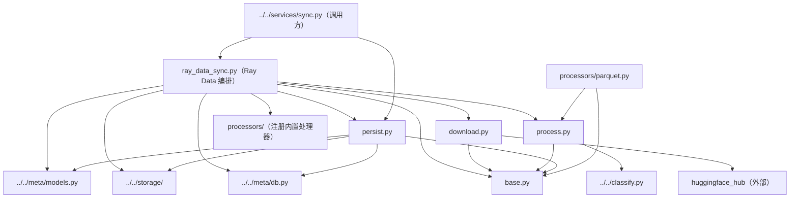

# downloaders 下载管线

`resolve -> raw 层入库 -> 资产层处理` 三段式资源管线，外加 **Ray Data 流式编排**（分片、背压暂停、崩溃自动重试）。只支持 `huggingface` 数据源。

## 文件结构

```
src/asset_management/assets/services/downloaders/
├── __init__.py       # 包声明；import 副作用注册 processors
├── base.py           # 共享契约：RemoteRef / Candidate dataclass + sha256_of / image_size / ext_of
├── download.py       # DownloadStage：resolve 文件清单 + 单文件下载（重试 + 退避 + 进度回调）
├── process.py        # Processor 抽象 + 注册表（PROCESSORS）+ FileProcessor（identity）
├── persist.py        # PersistStage：Candidate/候选行 -> storage + 元数据注册（sha256 去重）
├── ray_data_sync.py  # Ray Data 编排：SyncConfig/BackendConfig/PhaseOutcome + Phase A（raw 入库）/ Phase B（process+persist）两条管线
└── processors/       # 内置处理器子包（@register_processor 自注册）
    └── README.md     # 见该目录文档
```

## 各文件职责

| 文件 | 职责 | 关键内容 |
| --- | --- | --- |
| `__init__.py` | 注册入口 | `from . import download, persist, process` + `from . import processors`（触发处理器注册） |
| `base.py` | 数据契约 | `RemoteRef`（待下载文件）、`Candidate`（处理器产出的资产）；`sha256_of`/`image_size`/`ext_of` 工具 |
| `download.py` | 下载阶段 | `DownloadStage.from_source` 从 source.params 构建；`resolve()` 枚举 repo 文件（subfolder/allow/ignore 过滤）；`download()` 带重试退避与 tqdm 字节进度回调；`commit_hash()` 取 repo 最新 commit |
| `process.py` | 处理阶段 | `@register_processor(name)` 注册表；`get_processor` 按 `params.process` 选处理器；`FileProcessor` = 文件即资产 |
| `persist.py` | 持久化 | `persist_one`/`persist_one_row` 在 `db.transaction()`（BEGIN IMMEDIATE）内做「写入存储 + sha256 查重 + 注册」，并发安全；`persist_one_row` 接收节点无关候选行（payload 字节 / raw 层 source_key 零拷贝 copy） |
| `ray_data_sync.py` | 并行编排 | `BackendConfig`（可序列化的存储后端描述，boto3 client 不可 pickle）；Phase A `run_raw_upload`（下载 + 上传 `raw/` 层 + raw_files 登记）；Phase B `run_process_persist`（flat_map 解析 → materialize 边界 → map 持久化）；Ray Data 提供分片/背压/`max_retries` 崩溃重试 |

## 文件间依赖关系



要点：

- **两条 Ray Data 管线**：Phase A 逐行 `map`（下载 → raw 层上传）；Phase B 逐行 `flat_map`（拉 raw → processor → 候选行）→ `materialize` 阶段边界 → 逐行 `map`（persist）。候选行节点无关（payload 字节或 source_key），不传 worker 本地路径。
- **worker 状态共享**：每个 row 函数自开 DB 连接（`mark_stale=False`，只有 driver 能标记 stale run）、从 `BackendConfig` 重建后端；应用层错误在行内捕获成 outcome，不拖垮管线。
- **暂停语义**：管线是 pull-based——driver 停止拉取即背压停驻（in-flight 行完成，缓冲有界），worker 无需轮询。
- **持久化去重**：`PersistStage` 的 check-then-insert 在 `BEGIN IMMEDIATE` 事务内，跨进程串行化，同一 sha256 只注册一次。
- **注册表模式**：新增数据格式 = 写一个 `Processor` 子类 + `@register_processor(name)`，其余不动；`processors/__init__.py` 的 import 触发自注册。

## 管线数据流

```
RemoteRef（repo 文件清单）
   │  Phase A：DownloadStage.download（重试+退避）→ 上传 raw/<source_id>/<path>
   ▼
raw 层对象（raw_files 登记 sha256/size/commit）
   │  Phase B：get_file 拉取 → Processor.process（"file"=原样 | "parquet"=解行出图）
   ▼
Candidate 候选行（sha256 + 尺寸 + 类型 + payload/source_key）
   │  PersistStage.persist_one_row（事务内查重；source_key 走 copy_object 零拷贝）
   ▼
storage（blobs/ 内容寻址）+ db.add_asset（版本 v1 + raw 溯源）+ record_download
```
