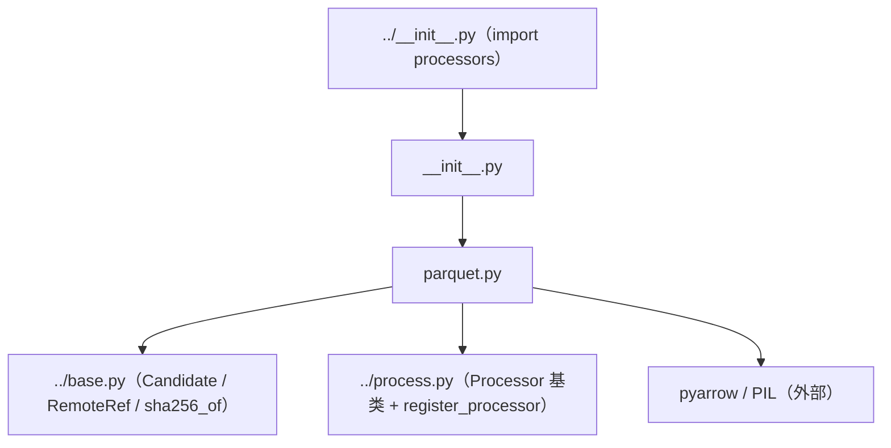

# processors 处理器子包

内置的 `Processor` 实现集，每个处理器通过 `@register_processor(name)` **自注册**到 `process.py` 的 `PROCESSORS` 注册表。

## 文件结构

```
src/asset_management/assets/services/downloaders/processors/
├── __init__.py     # 包声明；import parquet 触发注册（唯一内置处理器）
└── parquet.py      # ParquetProcessor：把下载的 parquet 解码成多张图片资产
```

## 各文件职责

| 文件 | 职责 | 关键内容 |
| --- | --- | --- |
| `__init__.py` | 注册入口 | `from . import parquet  # noqa: F401` —— 只靠 import 副作用完成注册 |
| `parquet.py` | Parquet 解码 | 流式 `iter_batches` 读取 HF datasets 风格 parquet（Image 列：bytes / dict / URL）；坏行跳过；PNG 保格式、其余转 JPEG(92)；提取后删除大文件释放磁盘 |

## 依赖关系



要点：

- **注册发生在 import 时**：`downloaders/__init__.py` import `processors` → `processors/__init__.py` import `parquet` → `@register_processor("parquet")` 写入注册表；`process.get_processor("parquet", params)` 即可取用。
- **新增处理器**：本目录下新建文件，子类化 `process.Processor`，用 `@register_processor(name)` 装饰，并在 `__init__.py` 中 import 即可，管线其余部分零改动。
- **处理器持有临时文件生命周期**：`process()` 签名收到 `work_dir`，可自行删除下载的临时文件（parquet 处理器在 `finally` 中删除）。

## 可用处理器

| 注册名 | 类 | 用途 | 参数 |
| --- | --- | --- | --- |
| `file` | `FileProcessor`（在 `process.py` 中） | 下载文件即资产（identity） | `asset_type` |
| `parquet` | `ParquetProcessor` | parquet 行 -> 图片资产 | `image_column`（默认 `image`）、`asset_type`（默认 `general_image`）、`batch_size`（默认 512） |
