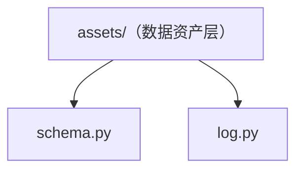

# asset_management 包结构

asset 主包当前只有**数据资产层**（`assets/` 子包）：统一资产管理（数据源 / 下载管线 / 内容寻址存储 / 标签 / 版本 / 快照 / 管理 API）。包根仅保留资产层依赖的公共底座：`schema.py`（样本契约与 JSONL 工具）和 `log.py`（统一日志）。

> 原 CLI 数据工厂（`cli.py` 及 generator/qa/render/split/templates 流水线模块）已移除；当前程序化入口是 `assets.api`，管理 API 由 `assets.routes` 提供，前端 UI 在独立 `frontend/` SPA。

## 文件结构

```
src/asset_management/
├── __init__.py            # 包声明 + 版本号（0.1.0）
├── schema.py              # 数据契约：ASSET_TYPES 常量 + write_jsonl 工具（资产层公共底座）
├── log.py                 # 统一日志（setup_logging / get_logger）
└── assets/                # 数据资产层子包（SQLite 元数据 + 可插拔 blob 存储）
    └── README.md          # 见该目录文档
```

## 各文件职责

| 文件 | 职责 | 关键内容 |
| --- | --- | --- |
| `__init__.py` | 包入口 | `__version__ = "0.1.0"` |
| `schema.py` | 数据契约 | `ASSET_TYPES` 常量（分类合法值集）；`write_jsonl`（pool 清单导出）|
| `log.py` | 日志基建 | 统一格式 `时间 \| 级别 \| [asset] \| 文件:行:函数 \| 消息` |

## 文件间依赖关系



要点：

- **`schema.py` 与 `log.py` 是资产层的公共底座**：`assets/classify.py` 用 `ASSET_TYPES`、`assets/services/materialize.py` 用 `write_jsonl`；`assets/` 各模块统一经 `get_logger` 打日志。
- **`assets/` 是独立子包**：内部按 meta / storage / services / routes 分层（见 [assets/README.md](assets/README.md)），对外只暴露 `assets.api` 与 `assets.routes`。

## 程序化使用

```python
from asset_management.assets.api import open_store

with open_store(data_dir="data") as store:  # env 配置后端（RUSTFS_* → S3，否则本地）
    report = store.import_dir(Path("./images"))
    store.sync_source(source_id)  # HF 源同步（Ray 逐文件任务）
    assets = store.list_assets(tags=["task=chart"])

# Web 管理界面（uvicorn 运行）
from asset_management.assets.routes import default_app

app = default_app()
```
