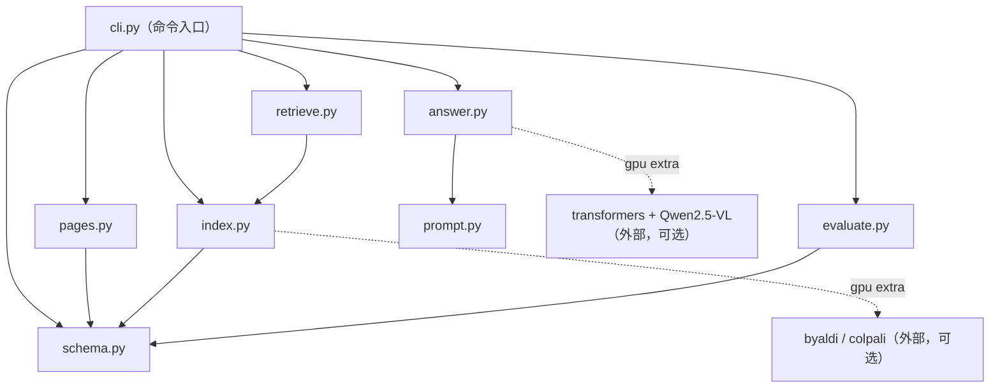

# mm_rag 包结构

多模态 RAG 企业财报助手：`PDF -> 页面渲染 -> 视觉索引 -> Top-K 召回 -> 证据组织 -> 多图推理 -> 评测`。核心是 **Vision-first 检索链**：页面图像直接进检索（ColPali + Byaldi），命中的原图送回 VLM 做多图推理。

## 文件结构

```
src/mm_rag/
├── __init__.py     # 包声明 + 版本号（0.1.0）
├── schema.py       # JSONL/JSON 读写工具（各阶段共享）
├── pages.py        # 页面资产层：PDF -> 页面 PNG + 提取文本 + page_units.jsonl
├── index.py        # 索引构建：Byaldi 视觉索引 / lexical 兜底（TF + BM25-lite）
├── retrieve.py     # Top-K 召回 + 目录页抑制（高仿召回误报过滤）
├── prompt.py       # 抗噪声 System Prompt + 证据回链模板
├── answer.py       # 多图推理：fallback（确定性证据组织）/ vlm（Qwen2.5-VL）
├── evaluate.py     # 评测：hit@k / 证据完备率 / 目录页抑制率
└── cli.py          # 命令入口（render-pdf | build-index | ask | evaluate）
```

## 各文件职责

| 文件 | 职责 | 关键内容 |
| --- | --- | --- |
| `__init__.py` | 包入口 | `__version__ = "0.1.0"` |
| `schema.py` | IO 工具 | `read_jsonl` / `write_jsonl` / `read_json` / `write_json` |
| `pages.py` | 页面资产层 | `render_pdf`（PyMuPDF 按 dpi 渲染 PNG）、`build_page_units`（附 `get_text()` 提取文本并落盘）、`page_by_id` 查询 |
| `index.py` | 索引构建 | `build_lexical_index`（中英文 tokenize + TF）、BM25-lite 打分 `_score_page`、`build_byaldi_index`（gpu extra）、`build_index`（按可用性自动选后端） |
| `retrieve.py` | 召回 | `retrieve`（lexical Top-K + `is_directory_page` 目录页启发式抑制）、`retrieve_visual`（byaldi 搜索） |
| `prompt.py` | 提示词 | `SYSTEM_PROMPT`（明确要求忽略目录页/封面、必须回链页码）、`build_messages`（每个证据页一个 `<image>` token）、`format_fallback_answer` |
| `answer.py` | 生成 | `answer(query, evidence, backend)`：fallback 走模板组织证据；vlm 用 transformers 加载 VLM 多图推理 |
| `evaluate.py` | 评测 | `evaluate(retrieval_results, ground_truth, top_k)` 输出 hit@k / evidence_completeness / directory_suppression |
| `cli.py` | 命令行 | 装配 pages/index/retrieve/answer/evaluate 四个子命令 |

## 文件间依赖关系



要点：

- **数据流单向推进**：pages → index → retrieve → answer，每步产出物在 CLI 中落盘（`page_units.jsonl` → `rag_index.json` → 检索结果 → 回答）。
- **`retrieve.py` 复用 `index.py` 的内部函数**（`_tokenize` / `_score_page`），保持打分与分词逻辑单一来源。
- **`prompt.py` 是纯函数模块**：只被 `answer.py` 使用；fallback 回答也走同一模板保证格式一致。
- **gpu 依赖延迟导入**：byaldi / transformers 只在对应路径按需 import（mm-rag 保留的已批准例外）。

## 端到端调用链

```
mm-rag build-index → cli → pages.build_page_units（渲染+文本）→ index.build_index（lexical 或 byaldi）
mm-rag ask        → cli → retrieve.retrieve(+目录页抑制) → answer.answer（fallback 或 vlm 多图推理）
mm-rag evaluate   → cli → retrieve + evaluate（对照 eval.jsonl 打分）
```
