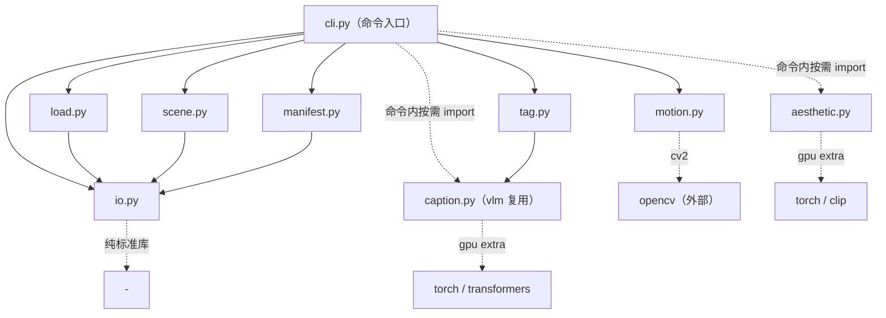

# video_generation 包结构

T2V 视频生成数据流水线：`源加载 -> 镜头切分 -> 运动过滤 -> 美学过滤 -> 多帧 caption -> 镜头语言标注` 六阶段 + manifest 汇总。每个阶段落盘 JSONL，支持断点续跑与 GPU 分片。

## 文件结构

```
src/video_generation/
├── __init__.py     # 包声明 + 版本号（0.1.0）
├── io.py           # 可续跑、可分片的 JSONL I/O（各阶段共享）
├── load.py         # Stage 1：源视频加载（manifest 或文件名恢复 + ffprobe 补齐元数据）
├── scene.py        # Stage 2：PySceneDetect 镜头切分 + ffmpeg 分片
├── motion.py       # Stage 3：Farneback 光流运动强度过滤
├── aesthetic.py    # Stage 4：CLIP + LAION-Aesthetic MLP 美学打分（gpu extra，OOM 自动降级）
├── caption.py      # Stage 5：多帧采样 + VLM 生成单段英文 caption（过短重试）
├── tag.py          # Stage 6：受控词表镜头语言标注 + 光流相机运动分类
├── manifest.py     # final manifest：按 shot_id join 各阶段 + 校验
└── cli.py          # 命令入口（6 阶段 + build-manifest）
```

## 各文件职责

| 文件 | 职责 | 关键内容 |
| --- | --- | --- |
| `__init__.py` | 包入口 | `__version__ = "0.1.0"` |
| `io.py` | I/O 基建 | `SafeJsonlWriter`（追加写、即时 flush）、`repair_tail`（丢弃被中断的残缺行）、`scan_done_ids`（断点续跑：跳过已处理 id）、`shard_for`/`merge_shards`（确定性分片合并） |
| `load.py` | Stage 1 | `_iter_manifest`（优先 `pexels_manifest.jsonl`，否则从 `pexels_<id>.mp4` 文件名恢复）；`ffprobe` 探测时长/fps/分辨率；`load_source_videos` 支持 resume |
| `scene.py` | Stage 2 | `split_one_video`（ContentDetector + `split_video_ffmpeg` 分片，过短镜头过滤）；`run_scene_detect` 按 video_id 断点续跑 |
| `motion.py` | Stage 3 | `compute_motion_magnitude`（降采样光流均值）；`motion_filter_one` 失败记录以 `status="error"` 保留 |
| `aesthetic.py` | Stage 4 | `build_aesthetic_mlp`（LAION-Aesthetic MLP）；`safe_call` 装饰器按 batch→frames→resolution→length 逐级降级；`score_shot_aesthetic` |
| `caption.py` | Stage 5 | `sample_frames_in_time_order`（时间序均匀采样）；`generate_video_caption`（video 多帧输入，过短时升温重试）；`torch_inference_guard` |
| `tag.py` | Stage 6 | `VOCAB` 受控词表；`sanitize_and_coerce_to_vocab`（自由文本归一到词表）；`flow_statistics` + `summarize_camera_motion`（static/zoom/pan/tilt/jitter/complex）；`tag_shot_language` 合并 VLM 标签与光流分类 |
| `manifest.py` | 汇总 | `build_manifest`（以 shot_id 为主键 join source/scenes/motion/aesthetic/captions/shot_language，缺失阶段容忍空）；`validate_manifest` 校验样本契约 |
| `cli.py` | 命令入口 | 7 个子命令装配；aesthetic/caption 在命令函数内按需 import（gpu extra） |

## 文件间依赖关系



要点：

- **`io.py` 是唯一共享基座**：load/scene/manifest（及 CLI）都依赖它，其余阶段模块之间不互相依赖 —— 每阶段可独立运行、独立续跑。
- **数据流靠文件契约连接**：前一阶段的 JSONL 是后一阶段的输入（`stageN_*.jsonl`），模块间零运行时耦合。
- **`tag.py` 的 VLM 分支复用 `caption.py` 的模型加载**（`load_vlm`），两者都在 `--vlm` 可选时按需加载。
- **gpu 依赖延迟导入**（aesthetic/caption 的 torch/transformers/clip 路径）是项目已批准的例外。
- **CLI 分片能力**：`motion-filter --workers` 单进程内分片；aesthetic 支持 `--num-shards/--shard-id` 确定性 GPU 分片。

## 六阶段数据流

```
load-sources ──► source_videos.jsonl（video_id 主键）
scene-detect ──► stage2_scenes.jsonl + shots/*.mp4（shot_id 主键）
motion-filter ─► stage3_motion.jsonl（shot_id）
aesthetic-filter ► stage4_aesthetic.jsonl（shot_id，GPU 分片）
caption ───────► stage5_captions.jsonl（shot_id）
tag-shot-language ► stage6_shot_language.jsonl（shot_id）
build-manifest ─► final_manifest.jsonl（以 shot_id join 全部）
```
