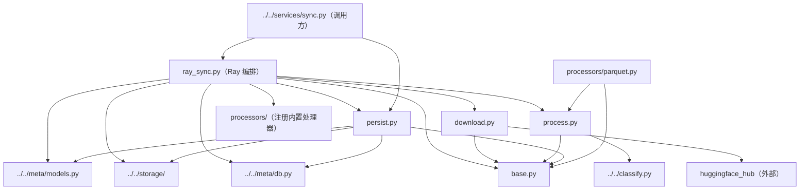

# downloaders 下载管线

`download -> process -> persist` 三段式资源下载管线，外加 **Ray 并行编排**（每文件一个任务、滑窗并发、崩溃自动重试）。只支持 `huggingface` 数据源。

## 文件结构

```
src/llava_instruct/assets/services/downloaders/
├── __init__.py       # 包声明；import 副作用注册 processors
├── base.py           # 共享契约：RemoteRef / Candidate dataclass + sha256_of / image_size / ext_of
├── download.py       # DownloadStage：resolve 文件清单 + 单文件下载（重试 + 退避 + 进度回调）
├── process.py        # Processor 抽象 + 注册表（PROCESSORS）+ FileProcessor（identity）
├── persist.py        # PersistStage：Candidate -> storage + 元数据注册（sha256 去重）
├── ray_sync.py       # Ray 编排：SyncConfig/BackendConfig/FileOutcome + _sync_file_task + run_ray_sync
└── processors/       # 内置处理器子包（@register_processor 自注册）
    └── README.md     # 见该目录文档
```

## 各文件职责

| 文件 | 职责 | 关键内容 |
| --- | --- | --- |
| `__init__.py` | 注册入口 | `from . import download, persist, process` + `from . import processors`（触发处理器注册） |
| `base.py` | 数据契约 | `RemoteRef`（待下载文件）、`Candidate`（处理器产出的资产）；`sha256_of`/`image_size`/`ext_of` 工具 |
| `download.py` | 下载阶段 | `DownloadStage.from_source` 从 source.params 构建；`resolve()` 枚举 repo 文件（subfolder/allow/ignore 过滤）；`download()` 带重试退避与 tqdm 字节进度回调 |
| `process.py` | 处理阶段 | `@register_processor(name)` 注册表；`get_processor` 按 `params.process` 选处理器；`FileProcessor` = 文件即资产 |
| `persist.py` | 持久化 | `persist_one` 在 `db.transaction()`（BEGIN IMMEDIATE）内做「写入存储 + sha256 查重 + 注册」，并发安全；`persist` 批量 + 进度回调 |
| `ray_sync.py` | 并行编排 | `BackendConfig`（可序列化的存储后端描述，boto3 client 不可 pickle）；`_sync_file_task` 在 Ray worker 内跑完整三段链；`run_ray_sync` 滑窗保持 `workers` 个任务在飞、pause 在文件边界停车、Ray 自动重跑崩溃任务 |

## 文件间依赖关系



要点：

- **每文件一个 Ray 任务**（`_sync_file_task`）：worker 自开 DB 连接（`mark_stale=False`，只有 driver 能标记 stale run）、从 `BackendConfig` 重建后端。
- **持久化去重**：`PersistStage.persist_one` 的 check-then-insert 在 `BEGIN IMMEDIATE` 事务内，跨进程串行化，同一 sha256 只注册一次。
- **注册表模式**：新增数据格式 = 写一个 `Processor` 子类 + `@register_processor(name)`，其余不动；`processors/__init__.py` 的 import 触发自注册。
- **暂停语义**：`_wait_until_resumed` 在下载前与持久化前停车，保证在飞下载结束后才落库（文件粒度 pause/resume）。

## 三段管线数据流

```
RemoteRef（repo 文件清单）
   │  DownloadStage.resolve / download（重试+退避）
   ▼
本地暂存文件
   │  Processor.process（"file"=原样 | "parquet"=解行出图）
   ▼
Candidate 列表（sha256 + 尺寸 + 类型）
   │  PersistStage.persist（事务内查重）
   ▼
storage.put_file（内容寻址）+ db.add_asset（版本 v1）+ record_download
```
